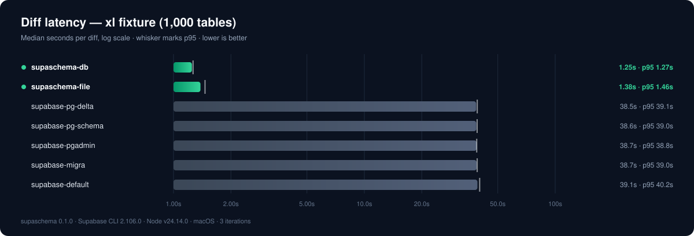
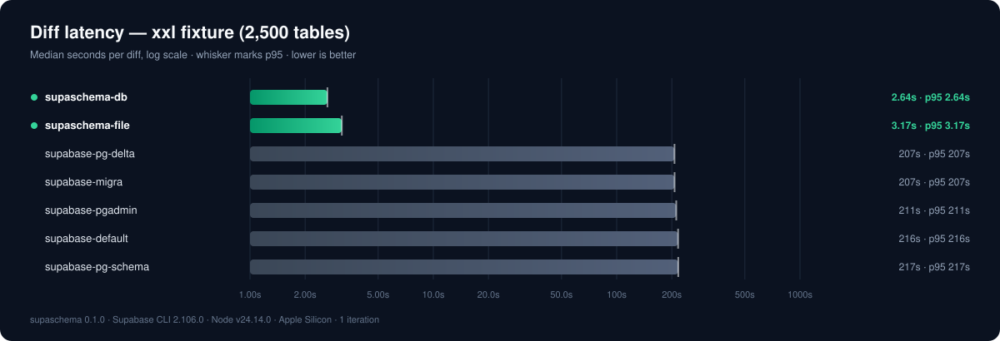

# pg-diverge

[](https://github.com/jmclaughlin724/pg-diverge/actions/workflows/ci.yml) [](https://www.npmjs.com/package/pg-diverge) [](https://www.npmjs.com/package/pg-diverge) [](https://github.com/jmclaughlin724/pg-diverge/blob/main/package.json) [](https://github.com/jmclaughlin724/pg-diverge/blob/main/LICENSE) [](https://codecov.io/gh/jmclaughlin724/pg-diverge) [](https://scorecard.dev/viewer/?uri=github.com/jmclaughlin724/pg-diverge) [](https://packagephobia.com/result?p=pg-diverge)

Deterministic, replay-safe PostgreSQL and Supabase migrations from declarative SQL trees — a TypeScript CLI and library with no Docker, no shadow database, and no diff-engine container.

**At a glance**, measured on identical fixtures and verified by applying every generated migration twice ([benchmarks](#benchmarks)):

|  | pg-diverge | Supabase CLI engines (all five) |
| --- | --- | --- |
| Diff latency, 1 → 2,500 tables (~17,500 objects) | 0.2s → 2.7s | ~7.5s → ~5 minutes |
| Generated SQL survives a second apply | every fixture | fails on column/index changes |
| Diff content vs intended change (F1) | 1.000 on every scored fixture | 0.982–0.999 (each missed a policy change) |
| Infrastructure per diff | none — pure TypeScript + WASM | Docker shadow database |
| Ambiguous change (rename, drop, type change) | blocked until explicitly hinted | inferred or dropped silently |

## The Problem

Your schema tree says what the database _should_ look like. A diff engine turns that into a migration — and today's engines fail in four ways:

- **Slow.** Every diff replays the entire schema into a throwaway Docker database: ~7.5 seconds for one table, ~5 minutes at 2,500.
- **Not replayable.** The generated SQL fails the second time it runs. One crashed deploy and you're hand-editing migrations.
- **Guesses.** Renames inferred from name similarity. Whole tables replaced to change one column.
- **Unproven.** The output is never executed the way `supabase db push` runs it — one transaction per file — so it can pass review and still fail in production.

pg-diverge fixes all four.

## Sixty Seconds

Edit your declarative tree — add a table, tighten a policy predicate, delete a legacy function — then ask for the migration:

```bash
npx pg-diverge diff --from git:HEAD --to dir:supabase/schemas --out stdout
```

```sql
-- Generated by pg-diverge 0.1.0.
-- Operations: 1 create constraint, 1 create table, 1 drop function,
--             1 replace policy, 1 replace view, ...
-- pg-diverge: lineage from=a145201bcaa397f6... to=4db806bc9b786ea2...
SET lock_timeout = '5s';
SET statement_timeout = '60s';

DROP FUNCTION IF EXISTS "app"."legacy_ping"();

CREATE TABLE IF NOT EXISTS app.audit_events (
  id bigint GENERATED BY DEFAULT AS IDENTITY NOT NULL,
  account_id bigint NOT NULL,
  event_name text NOT NULL
);

DO $pg_diverge$
BEGIN
  IF NOT EXISTS (SELECT 1 FROM pg_catalog.pg_constraint c ...) THEN
    ALTER TABLE app.audit_events ADD CONSTRAINT audit_events_pkey PRIMARY KEY (id);
  END IF;
END
$pg_diverge$;
```

That output is real (trimmed from the repo's `basic` fixture). Every statement carries a replay guard, statements arrive in dependency order, the timeout preamble bounds lock damage, and the lineage header chains the next migration to this one. Anything destructive or ambiguous refuses to render until you name the object in `hints.destructive` — the diff fails closed instead of guessing. On a real production Supabase schema (30 schemas, ~9,000 objects), a one-line tree edit diffs as exactly one operation in about a second.

## Benchmarks

The engine is hardened beyond synthetic fixtures: identity hashing, privilege-delta modeling, and the false-drift suppressions were each driven to convergence against an 8,300-statement production Supabase schema, and every noise class found there is pinned as a regression in the committed corpus ([docs/corpus.md](docs/corpus.md)).

Every number is reproducible from this repo and **verified, not just timed**: each generated migration is applied to a from-state database in one transaction (mirroring `supabase db push`), applied a second time to prove replay safety, and the resulting catalog fingerprint is compared against the target after each apply. Reference run (2026-06-11, sequential): Apple Silicon, Node 24, PostgreSQL 17.6, Supabase CLI 2.105. The 50/1,000/2,500-table fixtures are generated Supabase-shaped schemas (FKs, RLS policies, triggers, views, materialized views, functions, grants, comments, enums) with a mixed change set — column adds, a new table + FK, an enum append, a function body edit, a view redefinition, a partial index, a policy predicate, a comment.

### Latency at a realistic size (50 tables, ~350 objects)


Each bar is an engine's **median diff time** for the same 50-table fixture and change set; the tick marks p95. pg-diverge appears twice because both modes are measured — `pg-diverge-file` parses SQL sources, `pg-diverge-db` reads the live `pg_catalog`. Both land near **0.3s**; every shadow-database engine clusters near **8 seconds**, because each one replays the entire schema into a fresh Docker database before it can diff anything. This is the gap you feel in an editor loop or pre-commit hook.

### Latency at enterprise scale (1,000 and 2,500 tables)





Same chart, bigger schemas. At 1,000 tables (~7,000 objects) pg-diverge stays under **1s** while shadow-database engines take **~42–46 seconds**; at 2,500 tables (~17,500 objects) it is **~1.8–2.7s vs ~3.6–4.9 minutes**. The shape matters more than the numbers: pg-diverge's cost is parse/plan bound and grows roughly linearly with objects, while shadow replay grows with everything — the gap widens from ~30× to well over 100× as schemas get bigger.

### Correctness: applies once, applies twice, lands on target


Three checks per engine: the migration **applies once**, **applies a second time** (replay safety — what a crashed deploy or replayed environment needs), and the resulting **catalog matches the target** state. Every engine passes apply-once and catalog parity. The split is the second apply: Supabase engines emit unguarded `ADD COLUMN`/`CREATE INDEX`, so their migrations fail on re-run for every fixture containing column or index changes; pg-diverge passes everywhere because every statement is guard-rendered. Per-fixture charts: [additive](docs/benchmarks/additive-correctness.svg), [functions-policies](docs/benchmarks/functions-policies-correctness.svg), [realistic](docs/benchmarks/realistic-correctness.svg), [xxl](docs/benchmarks/xxl-correctness.svg) · small-fixture latency: [additive](docs/benchmarks/additive-latency.svg), [functions-policies](docs/benchmarks/functions-policies-latency.svg).

### Scaling summary (median, change vs each tool's own 1-table baseline)

| Tool | 1 table | 50 tables | 1,000 tables | 2,500 tables |
| --- | --- | --- | --- | --- |
| pg-diverge (file) | 203ms | 279ms (+37%) | 861ms (+324%) | 2,652ms (+1,206%) |
| pg-diverge (live db) | 250ms | 272ms (+9%) | 912ms (+265%) | 1,765ms (+606%) |
| supabase default | 9,400ms | 8,079ms (−14%) | 42,764ms (+355%) | 218,949ms (+2,229%) |
| supabase migra | 7,592ms | 7,764ms (+2%) | 45,353ms (+497%) | 294,067ms (+3,773%) |
| supabase pg-delta | 7,517ms | 8,569ms (+14%) | 41,838ms (+457%) | 244,773ms (+3,156%) |
| supabase pg-schema | 7,727ms | 8,188ms (+6%) | 42,833ms (+454%) | 279,616ms (+3,519%) |
| supabase pgadmin | 7,553ms | 8,189ms (+8%) | 46,304ms (+513%) | 280,360ms (+3,612%) |

Beyond latency, the harness scores **diff output accuracy** against a ground-truth change manifest (recall, precision, F1 — whole-table rewrites to change one column and destructive drop+create of data-bearing objects count against precision). On the scored fixtures pg-diverge measures **F1 1.000** in both modes at every scale; every Supabase engine measures **0.982 at 50 tables** (each one missed the policy-predicate change) and **0.999 at 1,000/2,500** (same miss, diluted by the larger manifest). Reproduce everything: `npm run benchmark` (internal threshold suite, CI-gated on PostgreSQL 15/16/17), `npm run bench:compare && npm run bench:plot` (cross-tool charts + results), or `bash benchmarks/tools/bench-all.sh` (full re-measure). Harness internals and the measured-results log live in [benchmarks/README.md](benchmarks/README.md).

## How It Works

1. **Extract** — every statement is classified through the real PostgreSQL parser (`libpg-query`), never regex, into a typed object model; live databases are read with batched read-only `pg_catalog` queries.
2. **Compare** — objects match by stable identity and a location-stripped parse-tree hash, so a definition in a SQL file and the same definition in a live catalog hash identically across keyword case, type aliases, constraint placement, and guard spellings. Privileges are modeled as deltas the way pg_dump does, so the ACL noise in every real catalog never reads as drift.
3. **Plan** — the diff orders topologically along AST-collected dependency edges; column changes become per-column `ALTER`s; everything destructive is hint-gated.
4. **Render** — guarded SQL (`IF NOT EXISTS`, `DROP IF EXISTS`, `CREATE OR REPLACE`, `pg_catalog`-qualified `DO` guards) with a lock/statement-timeout preamble and an embedded lineage marker; `CREATE INDEX CONCURRENTLY` splits into a `.concurrent.sql` companion under the `postgres` adapter.
5. **Gate** — writes are no-clobber, and a lineage chain gate refuses a migration whose from-state doesn't continue the newest pending one.
6. **Verify** — the migration is applied **twice** in disposable databases inside one transaction per file (mirroring `supabase db push`), the catalog fingerprint must equal the target's, and a reconvergence gate re-diffs the migrated catalog against the target model and requires **zero** residual operations.

## Install and Use

```bash
npm install --save-dev pg-diverge
```

Install scaffolds `pg-diverge.config.json` (with a `$schema` pointer, so your editor autocompletes and validates every key). In a Supabase project the database URL auto-discovers from `supabase/config.toml`; otherwise pass `--database-url`, set `PG_DIVERGE_DATABASE_URL`, or define named `environments` in the config and use `--env`. Requirements: Node `>=22`, PostgreSQL `15+`, schema-qualified SQL. `npx pg-diverge doctor` diagnoses a misbehaving setup in one report.

The loop:

```bash
# 1. Edit supabase/schemas/**, then render the migration
npx pg-diverge diff --from git:HEAD --to dir:supabase/schemas --name my_change

# 2. Gate it (replay safety, lock hazards), then prove it end to end
npx pg-diverge check supabase/migrations/<generated>.sql
npx pg-diverge verify --from git:HEAD --to dir:supabase/schemas --migration supabase/migrations/<generated>.sql

# 3. Apply through your runner — pg-diverge never touches your real databases
supabase db push
```

CI needs two gates (full recipes, a composite GitHub action, and a husky snippet in [docs/ci.md](docs/ci.md)):

```bash
# Drift gate: exit 3 if the live database and the tree diverged
npx pg-diverge diff --from "database:$DATABASE_URL" --to dir:supabase/schemas --fail-on-diff --quiet

# Migration gate: prove the PR's migration applies twice and lands on target
npx pg-diverge verify --from "git:origin/$BASE_REF" --to dir:supabase/schemas --migration <file>
```

## Commands

| Command | Does |
| --- | --- |
| `diff` | Render the replay-safe migration (`--fail-on-diff` CI gate, `--watch` editor loop, `--write-hints`, `--timing`) |
| `check` | Static replay-safety/lock-hazard gate for any migration files, even other tools' (`--reporter github\|sarif\|json`, stdin via `-`) |
| `verify` | Apply-twice + catalog-parity + reconvergence proof in disposable databases (`--keep-databases` for debugging) |
| `plan` / `inspect` / `fingerprint` | JSON diff plan · extracted model · one-line schema-equality hash |
| `migrations` | Disk files vs a target's applied history: applied / pending / ghosts / out-of-order |
| `sync` | Gate pending migrations, then (opt-in `--local`/`--remote`) drive the Supabase CLI |
| `audit` | Support-matrix coverage for adopting an existing schema |
| `corpus` / `selfcheck` | The engine's own correctness oracles ([docs/corpus.md](docs/corpus.md)) |
| `doctor` / `init` / `completion` / `explain` | Environment triage · config scaffold · shell completions · offline diagnostic decoder |

Full flags for every command: [docs/commands.md](docs/commands.md). Exit codes: `0` ok · `1` runtime error · `2` diagnostic errors · `3` drift found.

## Sources

Any source can be either side of a diff — and diff generation never creates a database, runs Docker, or uses a shadow database:

| Source | Reads |
| --- | --- |
| `dir:supabase/schemas` | a declarative SQL tree on disk |
| `git:HEAD` (any ref) | the tree at a git ref, scoped to `schemaPaths` |
| `database:$DATABASE_URL` | a live catalog via read-only `pg_catalog` queries |
| `dump:path.sql` / `dump:-` | one SQL file, or stdin (`pg_dump --schema-only \| pg-diverge diff --from dump:- ...`) |
| `catalog:path.json` | a saved `inspect` snapshot for air-gapped or point-in-time comparisons |

## Safety Model

Defaults: destructive changes are **hint-gated** (drops/replaces need the exact object key in `hints.destructive`), renames are **never inferred** (`hints.renames` only), `CASCADE` is **never emitted**, idempotency is **required**, and `transactionMode: "per-migration"` mirrors transactional runners. When intent cannot be proven from the parse tree, pg-diverge fails closed: incompatible view/routine replacements are blocked until hinted, column drops/type changes render data-preserving `ALTER`s only after the table key is hinted, data statements (`INSERT`/`UPDATE`/`DELETE`/`DO`) are never modeled as schema changes, and unsupported DDL emits a blocking diagnostic rather than passing through. Diagnostics redact credential shapes (URL passwords, JWTs, secrets). Recovery steps for blocked plans: [docs/hints.md](docs/hints.md) · full config reference: [docs/config.md](docs/config.md).

## Library API

Everything the CLI does is callable directly:

```ts
import {
  extractSourceModel, // any source prefix -> SchemaModel
  extractCatalogModel, // live pg_catalog -> SchemaModel
  planSchemaDiff, // two models -> MigrationPlan
  renderMigrationSplit, // plan -> { sql, concurrentSql? }
  checkMigrationSql, // SQL -> replay-safety/hazard diagnostics
  verifyMigration, // apply-twice + reconvergence proof
  migrationsStatus, // disk files vs applied history
  syncMigrations, // gate + orchestrate the migration runner
  runCorpus, // the corpus oracle
  resolveDatabaseUrl, // flag/$ENV > PG_DIVERGE_DATABASE_URL > supabase/config.toml
  parseLineage, // read the lineage marker from migration SQL
  loadConfig,
} from "pg-diverge";
```

Contracts include `Diagnostic`, `SchemaModel`, `MigrationPlan`, `MigrationsStatusReport`, `SyncResult`, `CorpusReport`, and `PgDivergeConfig`.

## Scope, Stability, Agents

The first release models schemas, extensions, types/enums/domains, tables, constraints, indexes, sequences, functions/procedures, views/materialized views, triggers, RLS, policies, grants/default privileges, foreign data wrappers/servers/foreign tables, and comments; the deliberate non-goals (partitioning, publications/subscriptions, event triggers, collations) fail closed with diagnostics ([docs/support-matrix.md](docs/support-matrix.md)). Pre-1.0: pin an exact version in CI; behavior changes surface as named diagnostic codes, decodable offline via `pg-diverge explain`. The package ships ready-made AI-agent guidance (`AGENTS.md`, `.claude/`, `.codex/`, `.agents/`) including PreToolUse hooks that block hand-edits to generated migrations. Examples for Supabase and generic PostgreSQL projects live under `examples/`.

## Documentation

[commands](docs/commands.md) · [config](docs/config.md) · [hints & recovery](docs/hints.md) · [CI recipes](docs/ci.md) · [diagnostics](docs/diagnostics.md) · [support matrix](docs/support-matrix.md) · [corpus oracle](docs/corpus.md) · [benchmark harness](benchmarks/README.md)

## Development

```bash
npm run check           # lint + typecheck + tests + build (database suites auto-resolve or skip)
npm run fixture:verify  # render the basic fixture migration, apply twice, compare catalogs
npm run corpus:check    # corpus oracle: dirty-real replay, diff, apply-twice, reconverge to zero
npm run benchmark       # threshold-enforced benchmarks
```

## Contributing and License

Bug reports and feature requests go through [GitHub issues](https://github.com/jmclaughlin724/pg-diverge/issues); run `npm run check` before opening a pull request. pg-diverge is dual-licensed: **AGPL-3.0-only** ([LICENSE](LICENSE)) for open-source use — derivative works, including network-accessible modified versions, stay AGPL — and **commercial** ([LICENSE-COMMERCIAL.md](LICENSE-COMMERCIAL.md)) for embedding pg-diverge in proprietary products or hosted services without releasing source.
