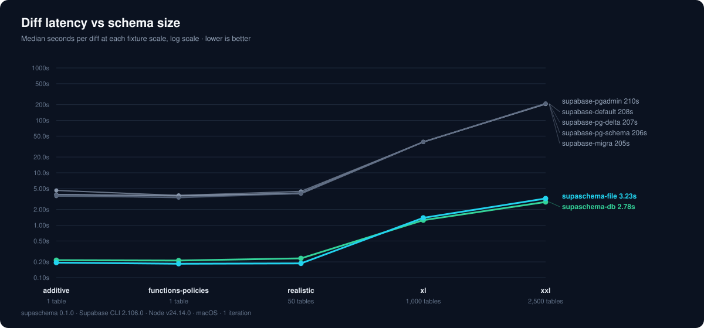
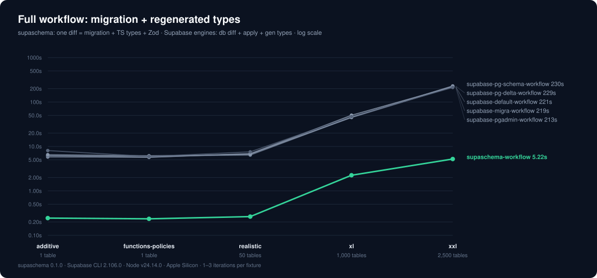
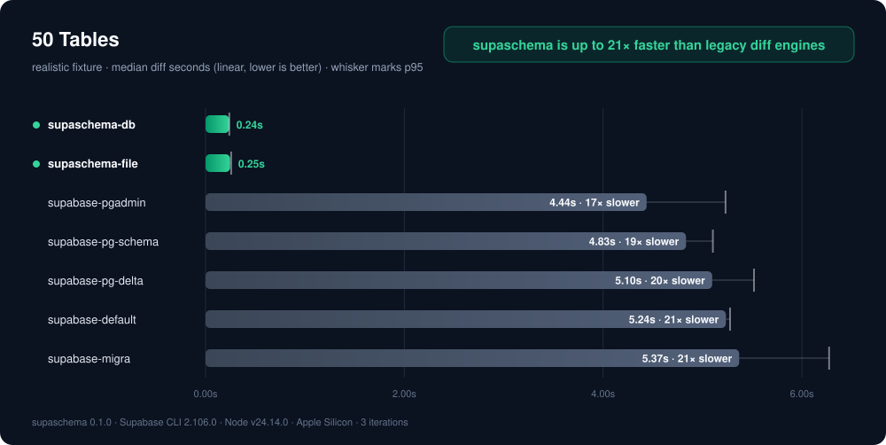
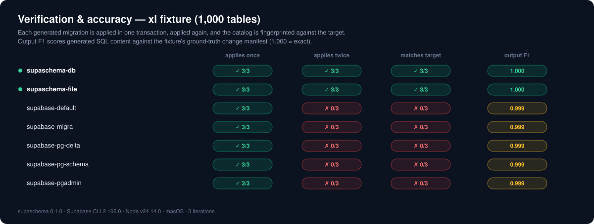

# supaschema

[](https://github.com/jmclaughlin724/supaschema/actions/workflows/ci.yml) [](https://www.npmjs.com/package/supaschema) [](https://www.npmjs.com/package/supaschema) [](https://github.com/jmclaughlin724/supaschema/blob/main/package.json) [](https://github.com/jmclaughlin724/supaschema/blob/main/LICENSE) [](https://codecov.io/gh/jmclaughlin724/supaschema) [](https://scorecard.dev/viewer/?uri=github.com/jmclaughlin724/supaschema) [](https://packagephobia.com/result?p=supaschema)

**Declarative Postgres and Supabase migrations in milliseconds — no Docker, no shadow database, no ORM.** supaschema reads your SQL with PostgreSQL's own parser, shipped as WASM inside the package, so it diffs your schema, writes a replay-safe migration, and regenerates your TypeScript + Zod types in a single command — without standing up a database to do it.

- **Fast at any scale.** It parses instead of replaying: a full diff of an 8,300-object production schema runs in under two seconds, where the Supabase CLI's shadow-database engines take minutes. The gap widens from ~20× to ~70× as your schema grows.
- **Catches the tenant-isolation regression other tools ship.** An RLS policy's `USING` predicate _is_ the tenant boundary. Every Supabase CLI engine diffs policies by name and silently drops a tightened predicate; supaschema compares policy bodies structurally and catches it before it merges.
- **Replay-safe by construction.** Every statement is guarded (`IF NOT EXISTS`, catalog-checked `DO` blocks), so a crashed or retried deploy just re-runs the file — where the CLI's unguarded `CREATE TABLE` / `CREATE INDEX` fail on the second apply.

```bash
npx supaschema diff   # writes the migration AND refreshes database.types.ts + database.zod.ts
```



The promise of declarative schema management sounds great: keep your schema in SQL files, edit them in your editor, diff against your database to produce a type-safe, idempotent migration, and get regenerated types back in your repo.

In practice, the existing tooling needs a running database at every step. Diff engines replay your schema into a throwaway Docker database just to read it, and type generators introspect only what your database has already applied — so an unapplied change sitting in your editor can't produce a migration or its types until the database catches up. That's a backlog, a time sink, and a constant drain on CPU.

supaschema knows every table, column, type, and enum without a database because it's built on PostgreSQL's own parser. The same system that would normally interpret your SQL inside a Docker container ships inside the package, embedded in your repo.

Migrations diff without an ORM, without Docker, without a shadow database, and without introspection — reading your live catalog directly and read-only, or your schema files and git refs with no database at all. Zod-validated types generate with no database whatsoever. Nothing is applied to your local or remote database. All within milliseconds.

Measured head-to-head against the Supabase CLI's diff engines on identical fixtures ([benchmarks](#benchmarks)):

|  | supaschema | Supabase CLI engines (all five) |
| --- | --- | --- |
| Diff latency, 1 → 2,500 tables (~17,500 objects) | 0.2s → 3.2s | 3.6–4.6s → ~3.5 minutes |
| Generated SQL survives a second apply | every fixture | fails on column/index changes |
| Diff content vs intended change (F1) | 1.000 on every scored fixture | 0.982–0.999 (every engine missed the same policy change) |
| Infrastructure per diff | none — pure TypeScript + WASM | Docker shadow database |
| Ambiguous change (rename, drop, type change) | blocked until explicitly hinted | inferred or dropped silently |

## Install

```bash
npm install --save-dev supaschema
```

Requires Node 22+ and PostgreSQL 15+. Run `npx supaschema init` to scaffold `supaschema.config.json`. In a Supabase project the database URL is discovered from `supabase/config.toml` automatically; anywhere else, set `SUPASCHEMA_DATABASE_URL` or define named `environments` in the config. If setup misbehaves, `npx supaschema doctor` prints a one-page diagnosis.

## Quick Start

Edit your schema files (`supabase/schemas/` by default), then generate the migration:

```bash
npx supaschema diff
```

supaschema compares the schema you declared with the schema your database has, and writes the difference to `supabase/migrations/<timestamp>_<name>.sql`:

```sql
-- Generated by supaschema 0.1.0.
-- Operations: 1 create constraint, 1 create table, 1 drop function, ...
-- supaschema: lineage from=a145201bcaa397f6... to=4db806bc9b786ea2...
SET lock_timeout = '5s';

DROP FUNCTION IF EXISTS "app"."legacy_ping"();

CREATE TABLE IF NOT EXISTS app.audit_events (
  id bigint GENERATED BY DEFAULT AS IDENTITY NOT NULL,
  account_id bigint NOT NULL
);

DO $supaschema$
BEGIN
  IF NOT EXISTS (SELECT 1 FROM pg_catalog.pg_constraint c ...) THEN
    ALTER TABLE app.audit_events ADD CONSTRAINT audit_events_pkey PRIMARY KEY (id);
  END IF;
END
$supaschema$;
```

Prove the migration, then apply it with your normal runner:

```bash
npx supaschema check    # static replay-safety and lock-hazard gate
npx supaschema verify   # applies it twice in throwaway databases, compares catalogs
supabase db push        # your runner applies it — supaschema never touches your real databases
```

Types come from the same tree, in the same step. Run `npx supaschema types` once to create `database.types.ts` and `database.zod.ts` (runtime Zod validators); from then on every `diff` refreshes them with the migration. You never wait for a deploy to get correct types.

No flags are needed day to day: sources, output paths, and names all have sensible defaults, every applied default is printed, and every flag overrides ([commands](#commands)).

## Features

- **Replay-safe by construction.** Every statement is guarded (`IF NOT EXISTS`, `DROP ... IF EXISTS`, catalog-checked `DO` blocks). A crashed deploy can simply run the file again.
- **Fails closed on ambiguity.** Drops, renames, and type changes stay blocked until you approve the exact object in `hints`. Nothing is inferred from name similarity.
- **Normalized output.** Migrations are written in one canonical SQL style, so formatting never shows up as a change. An object the deparser can't faithfully reproduce keeps your original spelling and says so with a warning.
- **Types and validators without a database.** `supaschema types` writes Supabase-compatible TypeScript types plus runtime Zod validators straight from your schema files, and `diff` refreshes both automatically with every migration. No introspection, no running database, no applying migrations first — the parser already knows your schema, so you never stop mid-workflow to deploy before types can regenerate.
- **No git ceremony.** Schema files are diffed straight from disk — no staging or committing before you can generate.
- **Everything stays in sync.** Your editor validates the config via JSON Schema and `--watch` re-diffs on save; named `environments` point commands at local, staging, or production; `migrations` reconciles files against each database's applied history; `--fail-on-diff` gates drift in CI.
- **Accuracy is measured, not assumed.** Diff output is scored against ground-truth change manifests ([benchmarks](#accuracy)).
- **AI agents are governed.** A bundled Claude Code + Codex rule, skill, and hook set blocks hand-edits to generated migrations ([AI agents](#ai-agents)).
- **Usable as a library.** Every CLI capability is an exported, typed function ([library](#library)).

## Benchmarks

All numbers are reproducible from this repo (`npm run benchmark`; harness in [benchmarks/README.md](benchmarks/README.md)) and verified, not just timed: every generated migration is applied in one transaction, applied a second time, and the resulting catalog is compared against the target. Reference run 2026-06-12: Apple Silicon, Node 24, PostgreSQL 17.6, Supabase CLI 2.106.0.

### Speed

**The diff alone** (charted at the top): supaschema's cost is parsing and planning, so it stays in seconds at every scale — **0.2s** at one table, **1.4s** at 1,000 tables, **3.2s** at 2,500 tables (~17,500 objects). Every shadow-database engine pays for a full schema replay into a fresh Docker database on every diff: **~4 seconds at a single table**, **~39 seconds** at 1,000 tables, and **~3.5 minutes** at 2,500 — a gap that widens from ~20x to ~70x as your schema grows.

**The full real-world step — migration plus regenerated types:**



In the real workflow you don't stop at the diff: you need the migration _and_ your regenerated types. For supaschema that's still one command — `diff` writes the migration and refreshes `database.types.ts` and `database.zod.ts` in the same invocation — so the full step costs **0.23s** at one table and **5.2s** at 2,500. The engines can't regenerate types from unapplied SQL, so their full step is `db diff`, then apply the migration, then `supabase gen types`: **~6 seconds** at a single table, **~45 seconds** at 1,000 tables, **~3.7 minutes** at 2,500 — and what comes back is TypeScript only, with no runtime validators.

| Median, full workflow | 1 table | 50 tables | 1,000 tables | 2,500 tables |
| --- | --- | --- | --- | --- |
| supaschema (migration + TS types + Zod) | 0.24s | 0.26s | 2.25s | 5.22s |
| supabase engines (diff + apply + gen types) | 5.7–8.1s | 6.4–7.6s | 44.8–50.4s | 212.6–229.7s |



| Median diff time     | 1 table | 50 tables | 1,000 tables | 2,500 tables |
| -------------------- | ------- | --------- | ------------ | ------------ |
| supaschema (files)   | 0.19s   | 0.19s     | 1.38s        | 3.23s        |
| supaschema (live db) | 0.21s   | 0.23s     | 1.25s        | 2.78s        |
| supabase default     | 3.86s   | 4.11s     | 39.12s       | 208.48s      |
| supabase migra       | 3.81s   | 4.43s     | 38.74s       | 204.54s      |
| supabase pg-delta    | 3.58s   | 4.15s     | 38.52s       | 207.47s      |
| supabase pg-schema   | 4.61s   | 3.98s     | 38.57s       | 205.59s      |
| supabase pgadmin     | 3.73s   | 4.01s     | 38.74s       | 209.98s      |

Per-fixture latency charts: [additive](docs/benchmarks/additive-latency.svg) · [functions-policies](docs/benchmarks/functions-policies-latency.svg) · [xl](docs/benchmarks/xl-latency.svg) · [xxl](docs/benchmarks/xxl-latency.svg).

### Accuracy

Two independent measures back every run. **F1** scores the emitted statements against a ground-truth change manifest by object identity — recall is "did you touch every object that changed", precision penalizes operations beyond the intent and destructive drop+create of data-bearing objects. The **catalog fingerprint** is the objective oracle that needs no manifest: the generated migration is applied to a throwaway database and the resulting catalog is compared to the target. F1 says you named the right objects; the fingerprint says the SQL is actually correct.

Every fixture is scored — the generated `realistic`/`xl`/`xxl` set and the hand-authored `additive`/`functions-policies` fixtures all carry manifests. supaschema scores **F1 1.000** on each, in both file and live-database modes. Every Supabase engine scores **0.982–0.999, and the gap is always the same miss: each silently dropped an RLS policy change** — and on that fixture each engine's migration also fails the fingerprint check, so the miss is confirmed objectively, not just by the rubric.

That miss matters more than speed. A slow diff costs seconds and an unreplayable diff costs a deploy, but a silently dropped policy change ships a tenant-isolation hole that review, CI, and the migration runner all wave through. The same comparison run against a real ~8,300-object production Supabase tree is written up in the [anilize case study](docs/case-study-anilize.md).

### Replay safety



Every engine's migration applies once and reaches the target catalog. Only supaschema's also applies **twice**: the others emit unguarded `ADD COLUMN` and `CREATE INDEX`, which fail on re-run for every fixture containing column or index changes. Per-fixture charts: [additive](docs/benchmarks/additive-correctness.svg) · [functions-policies](docs/benchmarks/functions-policies-correctness.svg) · [realistic](docs/benchmarks/realistic-correctness.svg) · [xxl](docs/benchmarks/xxl-correctness.svg).

## How It Works

supaschema reads SQL with PostgreSQL's own parser, shipped inside the package. The part of Postgres that understands SQL runs in the library itself — that's why no Docker and no shadow database are needed, and why the engine never touches SQL with regex.

1. **Parse** — every statement, from your files or a live database, becomes a parse tree.
2. **Compare** — two definitions are equal when their parse trees are equal. Formatting, keyword case, and type spellings can never show up as fake changes.
3. **Plan** — changes are ordered by dependency. Anything destructive waits for your explicit approval in `hints`.
4. **Render** — the migration is written as guarded SQL that is safe to run twice, stamped with a lineage marker that chains it to the next one.
5. **Gate** — existing migrations are never overwritten, and a migration that doesn't continue the chain is refused.
6. **Verify** — the migration runs twice in throwaway databases, applied exactly the way `supabase db push` applies it, and the result must match your schema files.

## Commands

| Command | Purpose |
| --- | --- |
| `diff` | Generate the migration (`--fail-on-diff` CI drift gate, `--watch` editor loop, `--out stdout`, `--write-hints`) |
| `check` | Static replay-safety gate for the migrations directory or named files — including other tools' migrations (`--reporter github\|sarif\|json`) |
| `verify` | Apply-twice proof for the newest pending migration in disposable databases |
| `types` | Generate Supabase-compatible TypeScript types and Zod validators from the schema tree — no database needed (`--out stdout` to print) |
| `plan` / `inspect` / `fingerprint` | JSON diff plan · extracted schema model · one-line schema-equality hash |
| `migrations` | Files on disk vs a database's applied history: applied, pending, ghosts, out-of-order |
| `sync` | Gate pending migrations, then optionally drive the Supabase CLI (`--local` / `--remote`) |
| `audit` | Coverage report for adopting an existing schema |
| `corpus` / `selfcheck` | The engine's own correctness oracles ([docs/corpus.md](docs/corpus.md)) |
| `doctor` / `init` / `completion` / `explain` | Setup diagnosis · config scaffold · shell completions · offline diagnostic decoder |

Defaults: `--from` is the database (falling back to `git:HEAD`), `--to` is the schema tree, and output lands in the migrations directory — paths set by `schemaPaths` and `migrationsDir` in the config. Full flags: [docs/commands.md](docs/commands.md). Exit codes: `0` ok · `1` runtime error · `2` diagnostic errors · `3` drift found.

## Sources

Either side of a diff can be any of these — generating a diff never creates a database or runs Docker:

| Source | Reads |
| --- | --- |
| `dir:supabase/schemas` | SQL files exactly as they sit on disk |
| `git:HEAD` (any ref) | the schema tree at a committed ref |
| `database:$DATABASE_URL` | a live catalog, read-only |
| `dump:path.sql` / `dump:-` | one SQL file, or stdin |
| `catalog:path.json` | a saved `inspect` snapshot, for air-gapped or point-in-time comparison |

## Safety

- Destructive changes require the exact object key in `hints.destructive`; column changes then render as per-column `ALTER`s instead of dropping and recreating the table, and type changes that would rewrite the whole table are flagged (`SUPA_CHECK_ALTER_COLUMN_TYPE_REWRITE`).
- Renames come only from `hints.renames`. `CASCADE` is never emitted. Idempotency is required, not optional.
- Data statements (`INSERT`/`UPDATE`/`DELETE`/`DO`) are never treated as schema changes, and unsupported DDL produces a blocking diagnostic instead of passing through.
- Diagnostics redact credentials (URL passwords, JWTs, secrets).
- Recovery steps for blocked plans: [docs/hints.md](docs/hints.md) · config reference: [docs/config.md](docs/config.md).

## AI Agents

The package ships a governance bundle so coding agents generate migrations through the diff instead of hand-writing SQL:

- `AGENTS.md` — operator brief: invariants, commands, recovery codes.
- `.claude/rules/` and `.codex/rules/` — the migration policy for Claude Code and Codex.
- `.claude/skills/supaschema/` — the step-by-step workflow skill, with recovery steps for every blocking `SUPA_*` code.
- `.claude/hooks/` and `.codex/hooks/` — wired PreToolUse hooks that **block any edit to a generated migration** (identified by its lineage marker) in both runtimes.

Copy the surfaces into your repo root to get the write-time enforcement — the hooks only run where `.claude/settings.json` and `.codex/hooks.json` are wired. Pointing agents at `node_modules/supaschema/` gives them the guidance without the hooks. `supaschema explain <SUPA_CODE>` decodes every diagnostic offline.

## Library

Every CLI capability is an exported, typed function:

```ts
import {
  extractSourceModel, // any source prefix -> SchemaModel
  extractCatalogModel, // live pg_catalog -> SchemaModel
  planSchemaDiff, // two models -> MigrationPlan
  renderMigrationSplit, // plan -> { sql, concurrentSql? }
  checkMigrationSql, // SQL -> replay-safety diagnostics
  verifyMigration, // apply-twice + reconvergence proof
  migrationsStatus, // disk files vs applied history
  syncMigrations, // gate + orchestrate the migration runner
  runCorpus, // the corpus oracle
  resolveDatabaseUrl,
  parseLineage,
  loadConfig,
} from "supaschema";
```

## Scope and Stability

Modeled: schemas, extensions, types/enums/domains, tables, constraints, indexes, sequences, functions/procedures, views/materialized views, triggers, RLS, policies, grants/default privileges, foreign data wrappers, comments. Deliberate non-goals (partitioning, publications, event triggers, collations) fail closed with diagnostics ([support matrix](docs/support-matrix.md)). Pre-1.0: pin an exact version in CI. Worked Supabase and plain-PostgreSQL setups live in `examples/`.

## Documentation

[commands](docs/commands.md) · [config](docs/config.md) · [hints & recovery](docs/hints.md) · [CI recipes](docs/ci.md) · [CI gate & paid tier](docs/ci-gate.md) · [diagnostics](docs/diagnostics.md) · [support matrix](docs/support-matrix.md) · [corpus oracle](docs/corpus.md) · [case study](docs/case-study-anilize.md) · [benchmark harness](benchmarks/README.md)

## Development

```bash
npm run check           # lint + typecheck + tests + build
npm run fixture:verify  # render a fixture migration, apply twice, compare catalogs
npm run corpus:check    # replay a dirty-real corpus and require reconvergence to zero
npm run benchmark       # threshold-enforced benchmarks
```

## Contributing and License

Bug reports and feature requests: [GitHub issues](https://github.com/jmclaughlin724/supaschema/issues). Run `npm run check` before opening a pull request.

supaschema is an independent open-source project and is not affiliated with or endorsed by Supabase.

Dual-licensed: **AGPL-3.0-only** ([LICENSE](LICENSE)) for open-source use, **commercial** ([LICENSE-COMMERCIAL.md](LICENSE-COMMERCIAL.md)) for embedding in proprietary products or hosted services.
