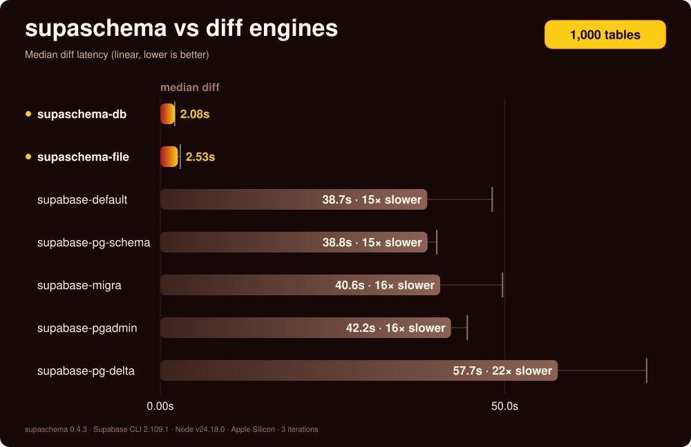

# supaschema

<p align="center">
  
</p>

[](https://github.com/jmclaughlin724/supaschema/actions/workflows/ci.yml) [](https://www.npmjs.com/package/supaschema) [](https://www.npmjs.com/package/supaschema) [](https://github.com/jmclaughlin724/supaschema/blob/main/package.json) [](https://github.com/jmclaughlin724/supaschema/blob/main/LICENSE) [](https://codecov.io/gh/jmclaughlin724/supaschema) [](https://scorecard.dev/viewer/?uri=github.com/jmclaughlin724/supaschema) [](https://packagephobia.com/result?p=supaschema)

[Documentation](https://supaschema.com/docs) | [Install](https://supaschema.com/docs/installation) | [Quickstart](https://supaschema.com/docs/quickstart) | [Commands](https://supaschema.com/docs/commands) | [Benchmarks](https://supaschema.com/docs/benchmarks) | [Coding agents](https://supaschema.com/docs/coding-agents)

**Declarative PostgreSQL schema management that turns SQL files into replay-safe migrations, generated TypeScript types, Zod validators, and guarded apply. No Docker, no shadow database, no ORM schema layer.**

Use it with plain PostgreSQL or hosted providers such as Supabase, Neon, RDS/Aurora, Cloud SQL, AlloyDB, and Azure PostgreSQL.

```bash
supaschema sync  # diff, check, types, stage, safety, apply/dry-run, reconcile
```



## Why supaschema

Declarative database workflows usually make the database part of the edit loop: replay a schema into a Docker shadow database, diff that database, apply the result, then introspect again to regenerate application types.

supaschema keeps the schema workflow inside the repository. It ships PostgreSQL's parser in the package, parses SQL files into a structural model, mines existing migrations for source intent, diffs object definitions, renders guarded migration SQL, and regenerates TypeScript and Zod outputs from the same tree.

- **Fast feedback:** generating a diff does not require Docker or a shadow database.
- **One schema owner:** PostgreSQL SQL remains the source of truth; generated migrations, TypeScript types, and Zod validators follow from it.
- **Replay safety:** generated SQL uses guarded operations and is checked statically before apply.
- **Reviewable risk:** destructive changes and renames fail closed until exact object-level hints approve them.
- **Agent-ready workflow:** `supaschema init` installs package-owned Claude/Codex/AGENTS enforcement so teams can block generated migration edits and run schema-write checks.

## Proof

The benchmark harness applies every generated migration once, applies it again, and compares the resulting catalog with the target schema.

- At 1,000 tables, supaschema stays in the single-digit seconds while benchmarked Supabase CLI diff engines depend on database-backed replay.
- At 2,500 tables, the benchmark docs report supaschema around three seconds while the compared engines cross three minutes.
- supaschema scores F1 `1.000` on every manifest-carrying fixture in file, live-database, and full-workflow modes.
- The compared Supabase CLI engines score `0.982-0.999`, miss the same RLS policy body change, and fail the second-apply check on the same benchmark lane.

Read the [benchmark methodology](https://supaschema.com/docs/benchmarks), the [Supabase CLI comparison](https://supaschema.com/docs/comparisons/supaschema-vs-supabase-cli), and the [anilize case study](https://supaschema.com/docs/case-study-anilize). Reproduce the local benchmark harness with:

```bash
npm run benchmark
```

## How it fits

supaschema replaces the PostgreSQL schema-management lane: schema diff, migration generation, safety checks, generated contracts, drift gates, staging, and guarded apply. Individual commands stay available for each action, including explicit runtime verification when a disposable database is intentionally available. Keep another tool when its distinct runtime, platform runner, query API, hosted dashboard, or cross-database scope is the part you intentionally want.

- Use it beside Supabase when you want Supabase project resources but do not want Docker-backed `db diff` as the migration generator.
- Use it beside Prisma or Drizzle when you want their query or client APIs but do not want an ORM schema DSL to own PostgreSQL intent.
- Use it beside Flyway or Liquibase when those tools own operational rollout but supaschema owns generated PostgreSQL migration SQL and checks.
- Use it beside Squawk or pgfence when you still need generation from declarative SQL, generated contracts, and apply-twice verification.

Detailed comparisons: [Supabase CLI](https://supaschema.com/docs/comparisons/supaschema-vs-supabase-cli), [Atlas](https://supaschema.com/docs/comparisons/supaschema-vs-atlas), [Prisma](https://supaschema.com/docs/comparisons/supaschema-vs-prisma), [Drizzle](https://supaschema.com/docs/comparisons/supaschema-vs-drizzle), [Squawk](https://supaschema.com/docs/comparisons/supaschema-vs-squawk), [pgfence](https://supaschema.com/docs/comparisons/supaschema-vs-pgfence), [Flyway](https://supaschema.com/docs/comparisons/supaschema-vs-flyway), and [Liquibase](https://supaschema.com/docs/comparisons/supaschema-vs-liquibase).

## Install

Install from the package or workspace directory that owns the schema workflow.

| Manager | Install command | Setup command | Run command |
| --- | --- | --- | --- |
| npm | `npm install supaschema` | `npm exec -- supaschema init` | `npm exec -- supaschema <cmd>` |
| pnpm | `pnpm add supaschema` | `pnpm exec supaschema init` | `pnpm exec supaschema <cmd>` |
| Yarn | `yarn add supaschema` | `yarn exec supaschema init` | `yarn exec supaschema <cmd>` |
| Bun | `bun add supaschema` | `./node_modules/.bin/supaschema init` | `./node_modules/.bin/supaschema <cmd>` |

Requires Node 22.12+. Commands that inspect, apply, or verify against a database expect PostgreSQL 15+.

Run both install and setup from the package or workspace directory that owns the schema workflow. `supaschema init` is idempotent. It reads the consuming repo's package manager, workspace owner, provider markers, schema paths, and migration paths, then writes the config, directories, generated-output paths, package-owned AI-agent enforcement, and path-confirmation state when needed. Raw AI-agent rules, hooks, skills, prompts, and settings also ship under `node_modules/supaschema/agent-bundle/` for audit and skipped-file repair. Workspace caveats live in the [installation guide](https://supaschema.com/docs/installation).

## Workflow

Edit the configured schema SQL files, then run the full workflow:

```bash
supaschema sync
```

Use `diff`, `check`, `types`, `stage`, or `apply` only when you need one focused lane. `sync` refreshes generated contracts even when no migration is pending and refuses multiple automatic targets because cross-target apply is not atomic.

Zero-flag commands read `supaschema.config.json`. Diff sources can be schema directories, Git refs, live read-only catalogs, SQL dumps, saved catalog snapshots, or an empty baseline. Full flags, defaults, and exit codes live in the [commands reference](https://supaschema.com/docs/commands) and [sources guide](https://supaschema.com/docs/concepts/sources).

Read config as four decisions: `schemaPaths` / `sources.to` / `migrationsDir` define the recursive schema tree, migration output, and migration-derived source-intent corpus; `sources.from` / `sources.to` define the diff inputs; `typesFile` / `zodFile` plus workflow type policies define generated contracts; and `workflow.migration_sync` plus `sync.targets` defines apply behavior.

## What ships

| Surface | What it gives you |
| --- | --- |
| CLI | `diff`, `stage`, `apply`, `types`, `check`, `verify`, `sync`, `migrations`, `config validate`, inspection commands, diagnostics, and shell completion. |
| Library | Typed ESM exports for the same core pipeline, including extraction, planning, rendering, checking, verification, apply/sync, type generation, and config loading. |
| Agent bundle | A public-safe prompt, rules, skills, and hooks for Claude, Codex, and AGENTS-compatible tools working in a consuming repository. |
| Docs site | Mintlify task guides, command pages, configuration references, comparison pages, support matrix, diagnostics, and commercial support intake. |

See [what's included](https://supaschema.com/docs/whats-included), [library API](https://supaschema.com/docs/reference/library-api), and [coding agents](https://supaschema.com/docs/coding-agents).

## Safety model

supaschema is fail-closed. Unsupported DDL blocks instead of passing through. Destructive changes and renames require explicit object-level hints. `CASCADE` is never emitted. Data statements stay outside the declarative schema shape, but existing reviewed migrations are source intent that must be modeled or preserved before blocking. Diagnostics redact credential-shaped values.

The support matrix covers schemas, extensions, types, domains, tables, foreign data wrappers, foreign servers, foreign tables, constraints, indexes, sequences, functions, procedures, views, materialized views, triggers, RLS, policies, grants, default privileges, comments, and intentionally unsupported boundaries.

Read [hints and recovery](https://supaschema.com/docs/configuration/hints), [diagnostics](https://supaschema.com/docs/reference/diagnostics), and the [support matrix](https://supaschema.com/docs/reference/support-matrix).

## Development

```bash
npm run check           # lint, typecheck, tests, and build
npm run fixture:verify  # render a fixture migration, apply twice, compare catalogs
npm run corpus:check    # replay a dirty-real corpus and require reconvergence
npm run benchmark       # threshold-enforced benchmarks
```

## Project

Public bugs and feature requests belong in [GitHub issues](https://github.com/jmclaughlin724/supaschema/issues). Do not put secrets, database URLs, customer data, or private schema dumps in public issues.

supaschema is an independent open-source project and is not affiliated with or endorsed by Supabase.

## Commercial Licensing And Support

supaschema is dual-licensed: **AGPL-3.0-only** ([LICENSE](LICENSE)) for open-source use, **commercial** ([LICENSE-COMMERCIAL.md](LICENSE-COMMERCIAL.md)) for embedding in proprietary products or hosted services.

Commercial licensing and support intake belongs in [commercial support](https://supaschema.com/docs/reference/support). This repository ships the local verifier and Worker source for paid entitlement; live billing, token issuance, support levels, and commercial rights require the operator deployment and a signed agreement.
